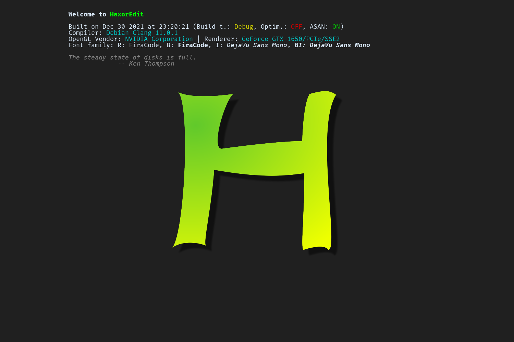
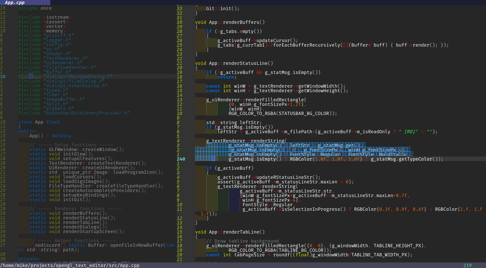
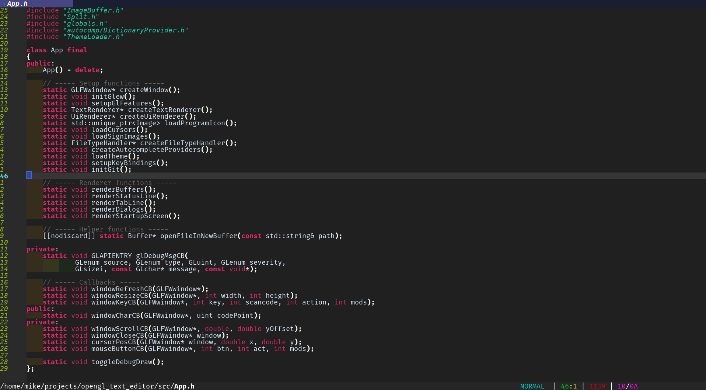

# HaxorEdit

Modern code editor for 1337 H4X0Rs.







## Features
- Basic features:
  - Unicode support
  - Line numbers
  - Custom syntax highlighting
  - Selection
  - Copy, deletion, cutting, pasting
  - Basic VIM movement keys
  - Mouse support
  - Tabs, splits
  - File modification detection
  - Indent rainbow
  - Indent guide
  - Undo/Redo
- Modal editing
- Image viewing
- Eclipse IDE theme support
- Custom message dialogs, file dialogs and floating windows
- Recent file list
- LSP support:
  - File open/close/change/willSave notifications
  - Autocomplete
  - Inline diagnostics
  - Symbol hover
  - Call help
  - Go to definition/declaration/implementation
  - Cross-file rename symbol
  - Code actions
  - Breadcrumb bar (using `textDocument/documentSymbol`)
  - Progress support
  - Execute command request support
- Basic Doxygen highlighting
- Autocompletion
  - LSP (already mentioned)
  - Buffer words
  - Dictionary words
  - File paths
- Git support:
  - Branch/tag/commit detection
  - Line change signs

### Internals:
- Fast, GPU-accelerated Unicode text renderer supporting ANSI escape sequences
- GPU-accelerated UI and image renderer
- Lightweight logger

## Building
### Dependencies
* CMake
* GLEW
* glfw
* glm
* freetype
* libgit2
* LspCpp dependencies:
    * boost-filesystem
    * boost-chrono
    * boost-date-time
    * boost-system
    * boost-thread
    * boost-program-options
    * rapidjson
    * utfcpp

Install them on Debian:
```
apt install cmake libglew-dev libglfw3-dev libglm-dev libfreetype-dev \
    libgit2-dev libboost-filesystem-dev libboost-chrono-dev \
    libboost-date-time-dev libboost-system-dev libboost-thread-dev \
    libboost-program-options-dev rapidjson-dev libutfcpp-dev
```

### Submodules
* [vscode-material-icon-theme](https://github.com/PKief/vscode-material-icon-theme) for icons
* [stb](https://github.com/nothings/stb) for image loading
* [cJSON](https://github.com/DaveGamble/cJSON) for JSON parsing
* [LspCpp](https://github.com/timre13/LspCpp_custom) (fork of [this](https://github.com/kuafuwang/LspCpp)) for LSP support
* [MD4C](https://github.com/mity/md4c) for supporting Markdown in LSP responses

### Compiling
```
python3 init.py
mkdir build
cd build
cmake ..
make
```
